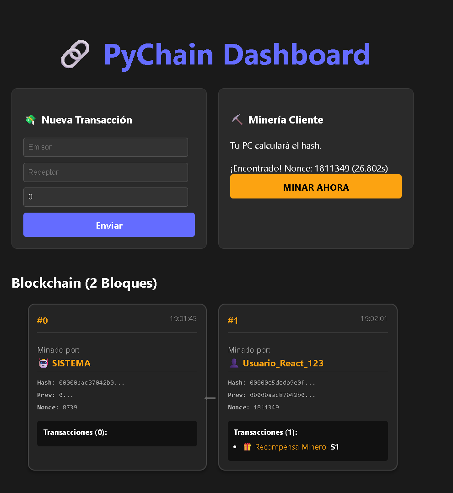

# 🔗 PyChain: Full Stack Decentralized Blockchain


> A purely educational implementation of a Blockchain architecture from scratch, featuring a Python RESTful API backend and a React/TypeScript frontend with client-side mining capabilities.


*(Replace this image with a real screenshot of your app)*

---

## 💡 About The Project

PyChain is not just a cryptocurrency simulation; it is a deep dive into the engineering concepts behind Web3. Unlike typical tutorials that run everything on the server, **PyChain implements a decentralized mining logic**:

* **The Backend (Python/Flask)** acts as the **Network Node & Validator**. It holds the ledger, validates hashes, and broadcasts difficulties.
* **The Frontend (React/TS)** acts as the **Miner**. It utilizes the client's browser CPU to solve the Proof of Work (PoW) algorithm effectively distributing the computational load.

### Key Features
* ⛓️ **Immutable Ledger:** Cryptographically linked blocks using SHA-256.
* ⛏️ **Client-Side Mining:** Browser-based Proof of Work mechanism (Stratum-like logic).
* 🏊 **Mempool System:** Transaction queue management before block inclusion.
* 🕵️ **Tamper Proof:** Automatic chain validation algorithms.
* ⚡ **Real-time API:** REST endpoints for transactions, chain data, and mining jobs.
* 🎨 **Modern Dashboard:** Interactive UI built with React & TypeScript.

---

## 🏗️ Architecture

The system follows a separated concern architecture:

1.  **Users** submit transactions via the UI.
2.  **Transactions** enter the **Mempool** (Backend).
3.  **Miners** (Clients) request a "Mining Job" from the server.
4.  The server constructs a **Candidate Block** and sends the challenge.
5.  The client performs the heavy calculation (finding the `nonce`).
6.  Once solved, the client submits the proof to the server.
7.  The server **Validates** the hash and adds the block to the chain.

---

## 🚀 Getting Started

Follow these steps to get a local copy up and running.

### Prerequisites
* Python 3.x
* Node.js & npm

### 1. Backend Setup (Python)

Navigate to the root directory:

```bash
# Create virtual environment
python -m venv venv

# Activate venv
# Windows:
.\venv\Scripts\activate
# Mac/Linux:
source venv/bin/activate

# Install dependencies
pip install Flask flask-cors

# Run the Node/Server
python api_blockchain.py